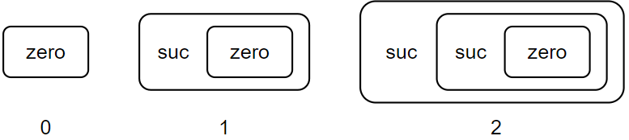
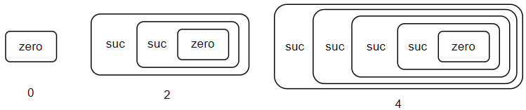
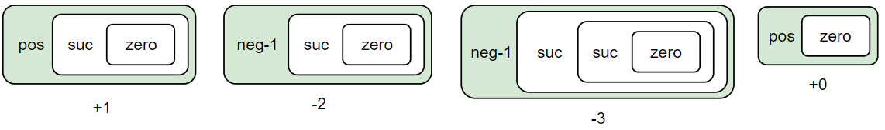
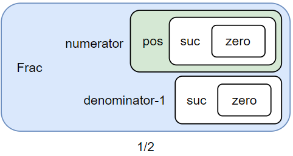

# 값, 타입, 함수
Agda는 "값, 타입, 함수" 이 셋으로 모든 수학적 증명들과 수학적 대상들을 표현해낸다. 

|Agda|수학|
|---|---|
|값|원소|
|타입|집합|
|함수|함수|

값, 타입, 함수는 각각 수학에서의 집합의 원소, 집합, 함수와 비슷한 의미를 띤다. 예를 들어 "1은 자연수 집합의 원소다" 라는 수학적 문장을 Agda의 개념들로 표현하면 "1은 자연수 타입의 값이다"라는 문장으로 표현될 수 있다.

# 값과 타입
타입은 수학에서의 집합과 비슷한 개념이다. 하지만 집합이 이미 있던 대상들의 모임 또는 특정 조건을 만족하는 모임으로 정의되는 것과 달리, 타입은 그 타입의 값을 만들어내는 방법들로부터 정의된다는 점에서 차이가 있다. 타입의 값을 만들어내는 방법(생성자)을 constructor라고 한다.

## 예시: Bool(논리값) 타입
true와 false라는 원소를 포함하는 Bool = {true, false}이라는 **집합**을 정의할 때를 생각해보자. 먼저, 원소 true와 false는 Bool과 연관되지 않은 독립적인 대상들로 정의된다. 그 후, Bool은 이 둘의 모임으로 정의된다.

반면 true와 false 값을 갖는 Bool **타입**을 정의하는 경우, 'true로 Bool 타입의 값을 만들 수 있다.', 'false로 Bool 타입의 값을 만들 수 있다'라는 정의로부터 Bool 타입, true, false가 정의된다.

```agda
data Bool : Set where
  true  : Bool
  false : Bool
```
- data ... where ... 구문은 타입 정의를 위한 구문이다.
- `Bool : Set`은 `Bool`이 타입임을 의미한다.
- `true : Bool`은 `true`로 `Bool` 타입의 값을 만들 수 있음을 의미한다.
   - true는 Bool의 constructor
- `false : Bool`은 `false`로 `Bool` 타입의 값을 만들 수 있음을 의미한다.
   - false는 Bool의 constructor
```agda
a : Bool
a = true

b : Bool
b = false
```
이 타입의 값을 담는 두 상수 a, b (a = true, b = false)는 위와 같이 표현할 수 있다. true와 false를 이용해 Bool 타입의 값을 만들 수 있다. 그리고 Bool 타입의 상수에 담을 수 있다. (어떤 타입의 상수는 그 타입의 값을 담는다.)

## 예시: Nat(자연수) 타입 (0 포함)
자연수 **집합**의 정의는, Bool처럼 단순하게 할 수가 없다. 실제로 자연수 집합은 각 요소들을 하나하나 나열하는 방법으로 정의되지 않고, 특정 조건을 만족하는 집합으로 정의가 된다. (페아노 공리계 참고)

반면 Nat **타입**을 정의하는 경우, 'zero로 Nat 타입의 값을 만들 수 있다.', 'suc으로 다른 Nat 타입의 값을 내부에 감싸고 있는 Nat 타입의 값을 만들 수 있다'라는 정의로부터 Nat 타입과 Nat 타입의 값들(자연수들)이 정의된다.



다른 Nat 타입의 값을 내부에 감싸고 있는 Nat 타입의 값이란, 위와 같은 것을 의미한다. suc 내부에 다른 Nat 타입의 값이 들어가 있는 것이다.

suc을 활용하면 계속해서 suc을 추가하는 형태로 무수히 많은 Nat 타입의 값을 만들 수 있다. 그리고, zero에는 0, suc 한 개가 있는 경우에는 1, suc 두 개가 있는 경우에는 2, ... 이런 식으로 suc의 개수를 이 Nat 타입의 값이 나타내는 자연수로서 생각하면, Nat 타입의 값을 자연수를 나타내는 데에 사용할 수 있다.

```agda
data Nat : Set where
  zero : Nat
  suc  : Nat → Nat
```
- data ... where ... 구문은 타입 정의를 위한 구문이다.
- `Nat : Set`은 `Nat`이 타입임을 의미한다.
- `zero : Nat`은 `zero`로 `Nat` 타입의 값을 만들 수 있음을 의미한다.
   - zero는 Nat의 constructor
- `suc  : Nat → Nat`은 안에 들어갈 `Nat` 타입의 값과 `suc`으로 `Nat` 타입의 값을 만들 수 있음을 의미한다.
   - suc은 Nat의 constructor
```agda
a : Nat
a = zero

b : Nat
b = suc (suc zero)

c : Nat
c = suc (suc (suc (suc zero)))
```
이 타입의 값을 담는 상수들 a, b, c (a = 0, b = 2, c = 4)는 위와 같이 표현할 수 있다. suc과 zero로 이루어진 구문이 0, 2, 4를 실제로 의미하는 것은 아니지만, 그걸 의미하는 것처럼 사용할 수는 있다.



## 예시: Int(정수) 타입
정수 **집합**은 자연수 집합을 어떻게 잘 쪼물딱 쪼물딱 하면 만들 수 있다.

Int **타입**을 정의하는 경우, 'pos로 다른 Nat 타입의 값을 내부에 감싸고 있는 Int 타입의 값을 만들 수 있다','neg-1로 다른 Nat 타입의 값을 내부에 감싸고 있는 Int 타입의 값을 만들 수 있다'라는 정의로부터 Int 타입과 Int 타입의 값들(정수들)이 정의된다.



Nat 타입의 값이 pos와 neg-1 안에 들어가있는 형태인 것이다. 만약 pos로 감싸진 경우에는 +(안에 있는 자연수)로, neg-1로 감싸진 경우에는 -(안에 있는 자연수) - 1로 해석하기로 하면, Int 타입으로 모든 정수들을 표현할 수 있다.

```agda
data Int : Set where
  pos   : Nat → Int
  neg-1 : Nat → Int
```
- data ... where ... 구문은 타입 정의를 위한 구문이다.
- `Int : Set`은 `Int`가 타입임을 의미한다.
- `pos : Nat → Int`는 안에 들어갈 `Nat` 타입의 값과 `pos`로 `Int` 타입의 값을 만들 수 있음을 의미한다.
   - pos는 Int의 constructor
- `neg-1 : Nat → Int`는 안에 들어갈 `Nat` 타입의 값과 `neg-1`로 `Int` 타입의 값을 만들 수 있음을 의미한다.
   - neg-1은 Int의 constructor

```agda
a : Int
a = pos (suc zero)

b : Int
b = neg-1 (suc (suc zero))

c : Int
c = neg-1 zero
```
Int 타입의 값을 담는 상수들 a, b, c (a = 1, b = -3, c = -1)는 위와 같이 표현할 수 있다. Nat과 마찬가지로, suc과 zero, neg-1과 pos로 이루어진 구문이 이런 숫자를 실제로 의미하는 것은 아니지만, 이런 숫자를 의미하는 것처럼 생각하고 사용할 수 있다.

## 예시: Frac(유리수) 타입
유리수 **집합**은 조건제시법으로 분모는 0이 아닌 자연수, 분자는 정수 라고 해서 정의할 수 있다.

Frac **타입**을 정의하는 경우, 'record 형태로 분모(Nat 타입의 값)와 분자(Int 타입의 값)를 내부에 감싸고 있는 Frac 타입의 값을 만들 수 있다'라는 정의로부터 Frac 타입과 Frac 타입의 값들(유리수들)이 정의된다.



Frac 안에 numerator와 denominator-1가 있어서 위와 같이 유리수를 표현할 수 있다. 분모는 0이 될 수 없기 때문에, 저장되어있는 denominator-1 값보다 1 큰 값을 분모로 해석해 사용하면 된다.

```agda
record Frac : Set where
  field
    numerator     : Int
    denominator-1 : Nat
```
- record ... where ... field ... 구문은 레코드(여러 값들을 내부에 갖고 있는 타입) 타입 정의를 위한 구문이다.
- `Frac : Set`은 `Frac`이 타입임을 의미한다.
- `field`에 있는 `numerator : Int`는 Frac 타입의 값을 만들기 위해서는 `numerator` 자리에 들어갈 `Int` 타입의 값이 필요함을 의미한다.
- `field`에 있는 `denominator-1 : Int`는 Frac 타입의 값을 만들기 위해서는 `denominator-1` 자리에 들어갈 `Nat` 타입의 값이 필요함을 의미한다.

```agda
a : Frac
a = record
  { numerator     = pos (suc zero)
  ; denominator-1 = suc zero
  }

b : Frac
b = record
  { numerator     = neg-1 (suc zero)
  ; denominator-1 = suc (suc zero)
  }
```
이 타입을 갖는 값의 상수들 a, b (a = 1/2, b = -2/3) 은 위와 같이 표현할 수 있다.


```agda
a : Frac
a = record
  { numerator     = pos (suc zero)
  ; denominator-1 = suc zero
  }

-- pos (suc zero)
a-numerator : Int
a-numerator = Frac.numerator a

-- suc zero
a-denominator-1 : Nat
a-denominator-1 = Frac.denominator-1 a
```
`Frac.numerator`나 `Frac.denominator-1`같은 함수를 이용하면 Record 타입의 값에서 특정 field의 값을 얻어낼 수 있다.

# 함수
방금까지 타입과 값을 만드는 방법들에 대해 다뤘다. 다음은 함수를 알아보자.

수학에서 함수란 total과 right-unique를 만족하는 relation이다. 이것이 뜻하는 것은, 수학에서 함수는 "f(x) = ~"의 명시적인 형태가 아니더라도 함수가 될 수 있다는 것이다. 예를 들어 어떤 비어있지 않은 자연수 부분집합을 입력받아 이 집합의 최솟값을 출력하는 함수는 명시적인 함수 형태로 쓸 수는 없지만 함수가 맞다.

반면 Agda에서 함수는 입력에 따른 출력이 "f(x) = ~" 꼴의 명시적인 형태로 정의되어 있어야 한다.

## 예시: f(x) = 2 + x
```agda
-- 함수를 정의한다.
f : Nat → Nat
f x = suc (suc x)

-- 함수를 호출한다.
-- a에는 suc (suc (suc zero))가 들어간다.
a : Nat
a = f (suc zero)
```
`f`의 타입 `Nat → Nat`은 Nat 타입의 값을 입력 받아 Nat 타입의 값을 출력하는 함수를 나타내는 타입이다. f는 Nat 타입의 값을 입력받아 Nat 타입의 값을 출력하므로 `Nat → Nat` 타입의 값이 맞다. (함수도 값처럼 취급될 수 있다.)

## 예시: not(x) = ~ x (논리 연산 not)
```agda
not : Bool → Bool
not true  = false
not false = true

-- a는 false
a : Bool
a = not true
```
`not`은 true가 입력된 경우 false를 출력하고, false가 입력된 경우 true를 출력하도록 정의되어 있다. 원래 Bool 타입의 입력 변수가 와야 할 부분에 true와 false라는 Bool 타입의 constructor가 들어와 있는데, 이와 같이 입력된 값의 constructor에 따라서 분기를 나눠 각각 함수를 정의하는 것을 pattern matching이라고 한다.

위 코드에서 `not`은 첫 번째 입력 변수에 대해 pattern matching을 해서, Bool 타입의 두 가지 constructor들에 대한 함수 두 개가 각각 정의되어 있다. 만약 true가 입력되는 경우 true 분기의 함수 정의가 사용되고, false가 입력되는 경우 false 분기의 함수 정의가 사용된다.

## 예시: minus-1(0) = 0, minus-1(1 + x) = x
```agda
minus-1 : Nat → Nat
minus-1 zero    = zero
minus-1 (suc n) = n

-- a는 zero
a : Nat
a = minus-1 zero

-- b는 suc (suc zero)
b : Nat
b = minus-1 (suc (suc (suc zero)))
```
`minus-1`는 (입력) - 1을 출력하되 0에서는 그대로 0을 출력하는 함수다.

`minus-1`는 첫 번째 입력 변수에 대해 pattern matching을 해서, Nat 타입의 두 가지 constructor들에 대한 함수 두 개가 각각 정의되어 있다. 만약 zero가 입력되는 경우 zero 분기의 함수 정의가 사용되고, suc이 입력되는 경우 suc 분기의 함수 정의가 사용된다. suc 분기의 경우에는, suc 안에 들어있던 자연수 값을 활용할 수 있다.

## 예시: add(a, b) = a + b
```agda
add : Nat → Nat → Nat
add zero    b = b
add (suc a) b = suc (add a b)

-- a는 suc (suc (suc (suc zero)))
a : Nat
a = add (suc zero) (suc (suc (suc zero)))
```
입력을 여러 개 받는 함수를 만들수도 있다. `add`는 첫 번째 입력 변수를 1씩 감소시키고,바깥에 suc을 하는 방식으로 구현된 덧셈 함수다.

## 예시: multiply(a, b) = a * b
```agda
multiply : Nat → Nat → Nat
multiply zero b    = zero
multiply (suc a) b = add b (multiply a b)
```
multiply도 유사하게 구현 가능하다.

## 예시: int-multiply(a, b) = a * b (Int)
```agda
int-multiply : Int → Int → Int
int-multiply (pos zero)    _             = pos zero
int-multiply _             (pos zero)    = pos zero
int-multiply (pos (suc n)) (pos m)       = pos (multiply (suc n) m)
int-multiply (pos (suc n)) (neg-1 m)     = neg-1 (minus-1 (multiply (suc n) (suc m)))
int-multiply (neg-1 n)     (pos (suc m)) = int-multiply (pos (suc m)) (neg-1 n)
int-multiply (neg-1 n)     (neg-1 m)     = pos (multiply (suc n) (suc m))
```
pattern matching을 여러 층 할 수도 있다. 위 코드에서는 바깥쪽에 pos로 패턴매칭을 한 번 하고, 안쪽에서 suc으로 한번 더 하고 있다. _는 사용하지 않는 변수를 무시하는 용도로 사용되었다.

## 예시: frac-multiply(a, b) = a * b (Frac)
```agda
frac-multiply : Frac → Frac → Frac
frac-multiply
  record
  { numerator = a
  ; denominator-1 = b
  }
  record
  { numerator = c
  ; denominator-1 = d
  }
  = record
  { numerator = int-multiply a c
  ; denominator-1 = add d (add b (multiply b d))
  }
```
record도 패턴매칭으로 전개하는 것이 가능하다.

## 예시: compose(f, g) = f . g (f와 g는 Nat → Nat)
```agda
compose : (Nat → Nat) → (Nat → Nat) → (Nat → Nat)
compose f g x = f (g x)
```
함수가 함수를 입력받을수도 있다.
```agda
compose : (Nat → Nat) → (Nat → Nat) → (Nat → Nat)
compose f g = λ x → f (g x)
```
람다 표기를 활용해 이렇게 표현할 수도 있다. (의미는 같음)