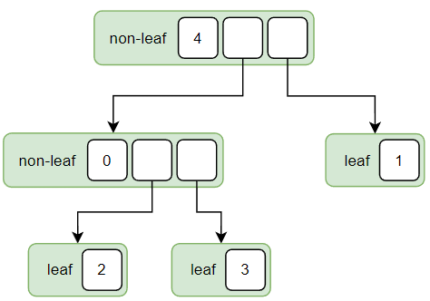

# 참고
- https://agda.readthedocs.io/en/v2.6.3/language/data-types.html

# Parametrized datatypes
Parametrized datatype은 뭔가를 입력받아서 동적으로 타입을 만들어내는 타입이다. 여기서 입력받는 뭔가를 "parameter"라고 한다.

## 예시: Product type

수학에서 집합 A와 집합 B의 Cartesian product는, 집합 A의 원소 a와 집합 B의 원소 b로 만들 수 있는 모든 (a, b) 쌍의 집합이다. 그리고 A × B로 나타낸다. 두 자연수의 Cartesian product는 ℕ × ℕ로, 두 정수의 Cartesian product는 ℤ × ℤ로 표기한다. 그럼 여기서, Cartesian product가 집합에 대해 하는 일을 타입으로 옮겨온다면 어떻게 표현할 수 있을까?

집합의 Cartesian product ×가 하는 일은 이렇다고 볼 수 있다.
- 두 개의 집합 A, B를 입력받는다.
- A의 원소 a와 B의 원소 b로 만들 수 있는 모든 (a, b)쌍의 집합을 출력한다.

이걸 타입으로 옮기면, 타입의 Cartesian product ×가 하는 일은 다음과 같을 것이다.
- 두 개의 타입 A, B를 입력받는다.
- A의 값 a와 B의 값 b로 만들 수 있는 모든 (a, b)쌍을 만들 방법을 제공한다.

여기서 Product 타입은 두 개의 타입 A, B를 입력받아 동적으로 결과 타입을 만들어내는 타입이 된다.

```agda
record _×_ (A : Set) (B : Set) : Set where
  field
    fst : A
    snd : B
```
두 개의 타입 A와 B를 입력받아서, Cartesian product (A, B) 같은 결과 타입을 만들어낸다.

```agda
-- (1, 0)
a : Nat × Nat
a = record
  { fst = suc zero
  ; snd = zero
  }

-- (2, -3)
b : Nat × Int
b = record
  { fst = suc (suc zero)
  ; snd = neg-1 (suc (suc zero))
  }
```
`_×_`는 양쪽 _ 부분에 입력 타입을 넣어 사용할 수 있다.
- (자연수, 자연수) 타입을 만들기 위해서는 `Nat × Nat`을 사용한다.
- (자연수, 정수) 타입을 만들기 위해서는 `Nat × Int`를 사용한다.
- (A, B) 타입을 만들기 위해서는 `A × B`를 사용한다.

## 예시: Disjoint union type
```agda
data _⊎_ (A : Set) (B : Set) : Set where
  inj₁ : A → A ⊎ B
  inj₂ : B → A ⊎ B
```
타입 A와 B를 입력받아 두 타입 A와 B를 합친(?) 것 같은 타입을 만들어낸다. (수학에서 정확히 이 개념에 대응되는 개념이 없음)

```agda
-- Nat 담기
a : Nat ⊎ Int
a = inj₁ (suc zero)

-- Int 담기
b : Nat ⊎ Int
b = inj₂ (neg-1 (suc zero))
```
- `inj₁`을 사용하면 `Nat ⊎ Int`에 Nat 타입의 값을 담을 수 있다. 
- `inj₂`를 사용하면 `Nat ⊎ Int`에 Int 타입의 값을 담을 수 있다.
- `inj₁`을 사용하면 `A ⊎ B`에 A 타입의 값을 담을 수 있다. 
- `inj₂`를 사용하면 `A ⊎ B`에 B 타입의 값을 담을 수 있다.

`A ⊎ B` 타입의 값은, `inj₁`로 A 타입의 값을 담고 있거나, `inj₂`로 B 타입의 값을 담고 있다.

```agda
is-nat : Nat ⊎ Int → Bool
is-nat (inj₁ _) = true
is-nat (inj₂ _) = false
```
`Nat ⊎ Int` 타입의 값을 입력받아 Nat 타입의 값을 담고 있는지 판별하는 함수를 작성할 수도 있다.


## 예시: Full binary tree
```agda
data BinTree (T : Set) : Set where
  leaf     : T → BinTree T
  non-leaf : T → BinTree T → BinTree T → BinTree T
```
타입 T의 값을 안에 저장하는 Full binary tree를 위와같이 표현할 수 있다.
- leaf는 T 타입의 값을 포함한다.
- non-leaf는 T 타입의 값, 왼쪽의 BinTree 값, 오른쪽의 BinTree 값을 포함한다.

```
a : BinTree Nat
a = non-leaf (suc (suc (suc (suc zero))))
  (
    non-leaf (zero)
    (
      leaf (suc (suc zero))
    )
    (
      leaf (suc (suc (suc zero)))
    )
  )
  (
    leaf (suc zero) 
  )
```


## 예시: List
```agda
data List (A : Set) : Set where
  []  : List A
  _∷_ : A → List A → List A
```
타입 A의 값을 갖는 유한수열(또는 배열)을 위처럼 표현할 수 있다.
- []는 빈 배열을 표현한다.
- \_∷\_는 배열의 맨 앞 요소와 나머지 배열을 포함해 배열에 아이템이 추가되는 것을 표현한다.
```agda
-- [ 1, 0, 2 ]
a : List Nat
a = (suc zero) ∷ (zero ∷ ((suc (suc zero)) ∷ []))

-- [ 0, 1, 0, 1 ]
b : List Nat
b = (zero) ∷ ((suc zero) ∷ (zero ∷ ((suc zero) ∷ [])))
```


# 타입을 입력받는 함수
타입을 입력받아 타입을 만들어내는 타입에 대해 다뤘다. 이번에는 타입을 입력받는 함수에 대해 알아보자.

## 예시: Compose function
수학에서 두 함수 f : B -> C와 g : A -> B의 합성은 f ∘ g로 표현된다. 그럼 여기서 ∘를 함수로 생각하면, 이 함수가 하는 일은 두 함수를 입력받아 두 함수를 합성한 결과 함수를 출력하는 것이라고 볼 수 있다.

Agda에서도 ∘와 유사한 함수를 만들 수 있을 것이다. 하지만 Agda에서는 다짜고짜 "B -> C"와 "A -> B"타입의 값을 입력받을 수는 없다. A, B, C가 뭔지 모르기 때문이다. 따라서 Agda에서는 A, B, C 타입을 미리 입력받고, 그 후 A -> B와 B -> C 타입의 값을 입력받는 식으로 합성함수를 만들어내는 함수를 구현한다.

```agda
compose : (A B C : Set) → (B → C) → (A → B) → (A → C)
compose _ _ _ f g = λ x → f (g x)
```
타입 A, B, C를 먼저 입력받고, 두 함수를 입력받아 두 함수의 합성함수를 출력한다. (함수의 본문에서는 타입 A, B, C를 사용하지 않기 때문에 _로 무시한다)
```agda
-- 절댓값 함수
g : Int → Nat
g (pos n) = n
g (neg-1 n) = suc n

-- 2의 배수 여부를 출력하는 함수
f : Nat → Bool
f zero = false
f (suc zero) = true
f (suc (suc n)) = f n

-- 둘의 합성
h : Int → Bool
h = compose Int Nat Bool f g
```
타입과 함수를 넣어서 합성함수를 만들 수 있다.

```agda
compose : {A B C : Set} → (B → C) → (A → B) → (A → C)
compose f g = λ x → f (g x)

h : Int → Bool
h = compose f g
```
Agda에서는 { ... } (Implicit argument) 표현으로 Agda가 다른 인자로부터 값을 추론하도록 지정할 수 있다. 이렇게 하면 입력받은 두 함수로부터 A, B, C를 Agda가 추론해 자동으로 넣어주기 때문에 compose 함수를 사용할 때 합성하고자 하는 두 함수만 넣으면 된다. (추론이 실패하는 경우, 직접 넣어줘야 할 수도 있다)
```agda
_∘_ : {A B C : Set} → (B → C) → (A → B) → (A → C)
f ∘ g = λ x → f (g x)

h : Int → Bool
h = f ∘ g
```
위처럼 정의하면 수학에서의 함수 합성 기호처럼 사용할 수 있다.

## 예시: Cartesian product mapping function
```agda
map : {A B C D : Set} → (A → C) → (B → D) → A × B → C × D
map f g z = record
  { fst = f (_×_.fst z)
  ; snd = g (_×_.snd z)
  }
```
A -> C, B -> D, (A, B) 타입의 값을 입력받아 각각을 매핑한 (C, D) 타입의 값을 출력해주는 함수다.
```agda
f : Nat → Bool
f zero = false
f (suc zero) = true
f (suc (suc n)) = f n

g : Int → Nat
g (pos n) = n
g (neg-1 n) = suc n

z : Nat × Int
z = record
  { fst = zero
  ; snd = neg-1 (suc zero)
  }

w : Bool × Nat
w = map f g z
```
`Nat × Int`의 Nat 부분은 f로, Int 부분은 g로 매핑해 `Bool × Nat`를 얻을 수 있다.

## 예시: Disjoint union mapping function
```agda
map : {A B C D : Set} → (A → C) → (B → D) → A ⊎ B → C ⊎ D
map f g (inj₁ a) = inj₁ (f a)
map f g (inj₂ b) = inj₂ (g b)
```
Disjoint union에도 유사한 매핑 함수를 만들 수 있다.

# Dependent type
지금까지는 타입이 타입에게, 값이 값에게 영향을 미치는 경우들만을 봤다. (타입이 값을 제한하기 때문에 타입이 값에게 영향을 미칠 수 있다고 볼 수도 있겠다.) 그렇담 만약 값이 타입에게 영향을 미칠 수 있다면? 그게 바로 Dependent type의 개념이다.

Dependent type은 값에 의해서 영향을 받는(값에 의해 결정되는) 타입이다. Dependent type을 활용하면 "false를 입력받았을 때에는 Nat 값을 출력하고, true를 입력받았을 때에는 Int 값을 출력하는 함수" 따위를 만들 수 있다. 또 Nat 타입의 값 n을 입력받아 길이가 n인 배열들의 타입을 출력하는 타입을 만들 수도 있다.

Dependent type 개념은 Agda의 모든 곳에서 언급 없이 당연하게 쓰이는데, 여기서는 dependent type 개념이 많이 사용되는 Indexed datatype과 Dependent function에 대해 알아본다. 이 둘을 보고 나면 Dependent type을 다른 곳에서도 쉽게 사용할 수 있을 것이다.

# Indexed datatypes
Indexed datatype은 뭔가를 입력받아서 서로 다른 타입을 만들어내는 타입이다. 여기서 입력받는 뭔가를 "index"라고 한다. Parameter는 입력에 따라 서로 전혀 연관이 없는 서로 다른 타입들을 만들어내는데에 사용되는것과 달리, index는 서로 연관이 있는 타입들을 구분하고, 값에 대한 정보를 타입에 담는 용도로 사용된다.

## 예시: Vector (길이가 있는 List)
```agda
data Vector (A : Set) : Nat → Set where
  []  : Vector A zero
  _∷_ : {n : Nat} → A → Vector A n → Vector A (suc n)
```
- `Nat → Set`은 Vector 타입이 Nat 타입의 값 한 개를 index로 입력받음을 의미한다.
- `[]  : Vector A zero`는 []로 Vector A zero 타입의 값을 만들 수 있음을 의미한다.
- `_∷_ : {n : Nat} → A → Vector A n → Vector A (suc n)`는 \_∷\_와 A 타입의 값, Vector A n 타입의 값으로 Vector A (suc n) 타입의 값을 만들 수 있음을 의미한다.

constructor에서 index의 값을 자유롭게 정하는 것을 볼 수 있다.
- []는 결과 타입의 index 값이 zero
- \_∷\_는 결과 타입의 index 값이 suc n

index 값이 위 규칙에 의해 정해지기 때문에, Vector의 index 값은 배열의 길이를 나타내게 된다.

```agda
-- []
a : Vector Nat zero
a = []

-- [0]
b : Vector Nat (suc zero)
b = (zero) ∷ []

-- [3, 1, 2]
c : Vector Nat (suc (suc (suc zero)))
c = (suc (suc (suc zero))) ∷ ((suc zero) ∷ ((suc (suc zero)) ∷ []))
```
배열 값들을 만들어보면, index는 실제로 배열의 길이값임을 확인할 수 있다.

## 예시: Even
```agda
data Even : Nat → Set where
  even-zero  : Even zero
  even-plus2 : {n : Nat} → Even n → Even (suc (suc n))
```
- `even-zero`와 `even-plus2` constructor들로부터 만들어진 값의 타입의 index는 늘 짝수이다.
- 홀수 인덱스를 갖는 Even 타입의 값을 만들 수는 없다.
```agda
-- Even 2
a : Even (suc (suc zero))
a = even-plus2 even-zero

-- Even 6
b : Even (suc (suc (suc (suc (suc (suc zero))))))
b = even-plus2 (even-plus2 (even-plus2 even-zero))

-- Even 1은 못 만들어!
c : Even (suc zero)
c = ?
```
그래서 `Even n` 타입의 값의 존재는, n이 짝수라는 것을 뜻한다.

## 예시: NonZero
```agda
data NonZero : Nat → Set where
  nonzero-one   : NonZero (suc zero)
  nonzero-plus1 : {n : Nat} → NonZero n → NonZero (suc n)
```
- `nonzero-one`과 `nonzero-plus1` constructor들로부터 만들어진 값의 타입의 index는 늘 1보다 크거나 같다.
- 인덱스가 0인 NonZero 타입의 값을 만들 수는 없다.
```agda
-- NonZero 2
a : NonZero (suc (suc zero))
a = nonzero-plus1 nonzero-one

-- NonZero 3
b : NonZero (suc (suc (suc zero)))
b = nonzero-plus1 (nonzero-plus1 nonzero-one)

-- NonZero 0은 못 만들어!
c : NonZero zero
c = ?
```
그래서 `NonZero n` 타입의 값의 존재는, n이 0이 아니라는 것을 뜻한다.

# Dependent function
Dependent function은 함수의 입력 값에 함수의 출력 타입이 영향을 받는 함수다. (다른 입력 타입에 영향을 미치는 경우도 포함됨)

## 예시: Nat Vector 덧셈 함수
```agda
add-nat-vector : {l : Nat} → Vector Nat l → Vector Nat l → Vector Nat l
add-nat-vector []       []       = []
add-nat-vector (a ∷ as) (b ∷ bs) = (add a b) ∷ (add-nat-vector as bs)
```
자연수 유한수열 두 개를 입력받아 원소를 각각 덧셈한 결과 유한수열을 출력하는 함수.
- 첫 번째 implicit 입력으로 받은 자연수 l 값에 따라 함수의 출력 타입이 변한다.

## 예시: 입력이 true면 Nat 타입의 값을, false면 Int 타입의 값을 반환하는 함수
```agda
f : Bool → Set
f true  = Nat
f false = Int

g : (x : Bool) → f x 
g true  = suc zero
g false = neg-1 zero
```
- f는 true일 때 Nat을, false일때 Int를 출력하는 함수다.
- 이 함수를 이용해서 g의 반환 타입이 입력이 true일때는 Nat이 되고, false일때에는 Int가 되도록 정의한다.
- pattern matching된 true, false 분기에 각각 Nat 타입과 Int 타입의 값이 있다.

```
a : Nat
a = g true

b : Int
b = g false
```
true랑 false를 넣어 보면 실제로 서로 다른 타입의 값이 나온다.

## 예시: 특정 원소로 차있는 길이 l짜리 Vector를 만들어주는 함수
```agda
fill : {A : Set} → A → (l : Nat) → Vector A l
fill a zero    = []
fill a (suc l) = a ∷ fill a l
```
이 함수는 두 번째 입력으로 받은 자연수 l에 따라 출력 타입이 변한다.

```agda
-- [1, 1, 1]
a : Vector Nat (suc (suc (suc zero)))
a = fill (suc zero) (suc (suc (suc zero)))

-- [2]
b : Vector Nat (suc zero)
b = fill (suc (suc zero)) (suc zero)

-- [-1, -1]
c : Vector Int (suc (suc zero))
c = fill (neg-1 zero) (suc (suc zero))
```